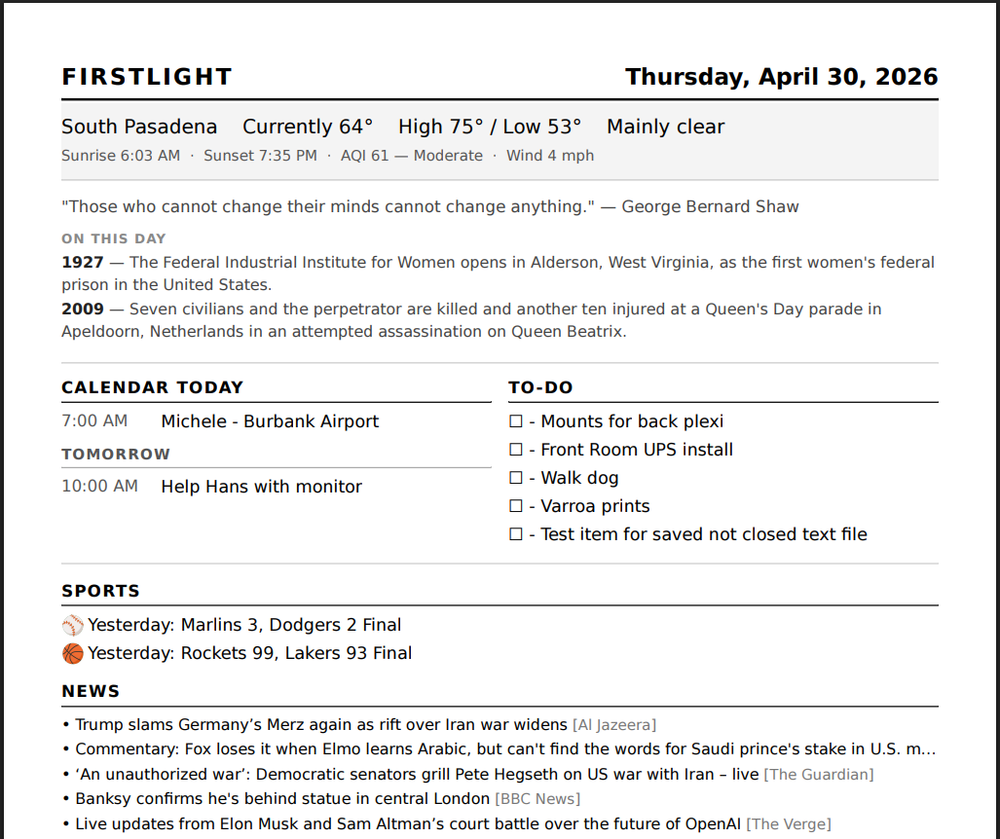

# Firstlight

Firstlight is a self-hosted daily digest application that delivers a personalized, print-ready morning briefing straight to your printer. Each day it pulls together local weather with hourly forecasts and air quality, your Google Calendar events, sports scores from your favorite teams across MLB, NFL, NBA, NHL, WNBA, NWSL, MLS, and the Premier League, curated news headlines from RSS feeds you choose, and a to-do list you manage yourself — all rendered into a clean, single-page PDF that prints automatically at whatever time you set. A quote of the day and an "on this day in history" entry round out the digest with a touch of personality.

Firstlight runs 24/7 in Docker on any always-on home server or NAS, with a first-run setup wizard that walks you through configuration in minutes. Most data sources are free and require no account — weather from Open-Meteo, sports from ESPN, and news from standard RSS feeds. Google Calendar is the one optional integration that requires a Google Cloud account. A built-in web interface lets you preview the digest on demand, manage your to-do list, browse a personal archive of past digests, and trigger a print from any device on your home network. Firstlight is designed to be simple to deploy, easy to maintain, and genuinely useful every single morning.



## Motivation

Firstlight started as a personal project to reclaim the morning. The habit of reaching for a phone first thing — scrolling through news, notifications, and feeds designed to capture attention — felt like a bad way to start the day. A printed page doesn't notify you. It doesn't update. It doesn't pull you somewhere else. It just sits there with exactly the information you chose, ready when you are.

The digest is designed to be read over coffee in a few minutes: the weather, what's on the calendar, scores from last night, a handful of news headlines you actually want, and a short to-do list for the day. Everything useful, nothing extra. Once it's printed, the day can start on your terms.

This probably resonates most with people who've reached a point in life where they're actively trying to reduce screen time — not out of discipline, but because they've simply stopped finding the scroll rewarding. If that sounds familiar, Firstlight might be worth trying.

## Before You Begin

Installation requires basic comfort with the command line — cloning a repository, editing a configuration file, and running Docker commands. You don't need to be a developer, but you should be at ease in a terminal.

The documentation includes notes for QNAP NAS deployment, which is what the author runs, but Firstlight will work on any always-on server or NAS that supports Docker. Your environment will likely differ in small ways. Server environments vary enough that the setup process sometimes needs a small adjustment from the defaults documented here. Using an LLM coding assistant (Claude, ChatGPT, or similar) during installation is genuinely recommended — it can diagnose errors specific to your environment, explain what each step does, and suggest fixes without requiring you to search through documentation.

The same applies if you want to extend Firstlight. The codebase is intentionally straightforward, and adding a new data source, changing the layout, or wiring up a service that isn't built in yet is the kind of task an LLM coding assistant handles well. If you have an idea for a feature, it's likely within reach.

## Prerequisites

| Requirement | Notes |
|-------------|-------|
| **Docker Engine 20.10+** or Docker Desktop | The `docker compose` plugin (v2) is required — if your system only has the older `docker-compose` command, update Docker first. |
| **Git** | To clone the repository. |
| **1 GB free disk space** | The base image and dependencies take ~500 MB. PDF archives add ~200–400 KB per day; the default 30-day retention uses roughly 10–15 MB. |
| **Stable LAN IP for the server** | Recommended. A changing IP won't break daily printing, but it will break the Google Calendar OAuth callback and makes accessing the web interface less predictable. Most routers support a DHCP reservation — assign one to your server's MAC address. |
| **Network printer with IPP Everywhere support** | Most printers made after 2015 qualify. Driverless IPP Everywhere is used — no driver installation needed. The printer must be on the same network as the server. |

**Google Calendar note:** the OAuth authorization flow requires a browser to open the Google sign-in page and be redirected back to Firstlight. This means your server must be reachable at a known address (e.g. `http://192.168.4.27:8088`) from the browser you're using during setup. If the server is only accessible via `localhost`, the redirect will fail unless the browser is running on the server itself.

## Getting Started

### 1. Clone and configure

```bash
git clone https://github.com/cruftbox/firstlight.git firstlight
cd firstlight
cp .env.example .env
```

Open `.env` and replace `changeme-replace-with-a-long-random-string` with any long random string. This is used to secure browser sessions — it doesn't need to be memorable, just unique. See [Generating SECRET_KEY](#generating-secret_key) for a quick way to generate one.

### 2. Build and start

```bash
docker compose up --build
```

The first build downloads the base image and installs dependencies — expect **3–5 minutes**. You'll see log output as it progresses. When you see a line like:

```
firstlight  | * Running on http://0.0.0.0:5000
```

Firstlight is running.

### 3. Complete the setup wizard

Open **http://localhost:5000** in your browser (or replace `localhost` with your server's IP address if running on a NAS or remote machine).

You'll be redirected to the setup wizard automatically. It covers:

| Step | What you configure |
|------|--------------------|
| 1 | Paper size |
| 2 | Location (for weather) |
| 3 | Print time and timezone |
| 4 | Network printer IP |
| 5 | Optional content — quote, history, AQI, to-do source |
| 6 | Google Calendar (optional — skip if not needed) |
| 7 | Sports teams |
| 8 | News RSS feeds |
| 9 | Email delivery (optional) |
| 10 | Review and finish |

Most steps take under a minute. Calendar setup requires a Google Cloud project — see [Google Calendar Setup](#google-calendar-setup) below if you want to enable it.

### 4. Verify it works

Once the wizard completes you'll land on the home page. Click **Preview PDF** to see what the digest looks like, or **Print Now** to send it to your printer immediately.

From this point Firstlight will print automatically every morning at the time you configured. All settings can be changed later at any time from the Settings page.

## Features

- **Weather** via Open-Meteo (free, no API key)
- **Quote of the Day** via ZenQuotes (free, no API key)
- **Google Calendar** integration (optional — paste OAuth credentials in wizard)
- **Sports scores** via ESPN API (MLB, NFL, NBA, NHL, WNBA, NWSL, MLS, Premier League)
- **RSS news feeds** with age filtering
- **To-do list** — built-in web UI, plain text file (e.g. Syncthing), or external REST API
- **PDF archive** with configurable retention (default 30 days)
- **Email delivery** (SMTP; supports Gmail App Passwords)
- **Network printer** via CUPS inside the container — enter your printer's IP in the wizard, no drivers needed

## Credentials and API Keys

Firstlight is deliberately light on credentials. Most data sources require no account or API key.

| Source | Credential required | Where to get it | Free tier |
|--------|--------------------|--------------------|-----------|
| **Weather** (Open-Meteo) | None | — | Always free |
| **Sports** (ESPN) | None | — | Always free (undocumented public API) |
| **News** (RSS feeds) | None | — | Always free |
| **Quote of the day** (ZenQuotes) | None | — | Always free |
| **On this day** (Wikipedia) | None | — | Always free |
| **Google Calendar** | OAuth credentials JSON | [Google Cloud Console](https://console.cloud.google.com/) | Free — personal use is well within the no-cost tier |
| **Email delivery** | SMTP host, username, password | Your email provider (Gmail, Fastmail, etc.) | Depends on provider — Gmail App Passwords are free |
| **External task API** *(optional)* | API key / bearer token | Your chosen service | Depends on service |
| **SECRET_KEY** | Self-generated string | Generate locally — see below | Free |

The only step that requires external account setup is Google Calendar, and that step is entirely optional. If you skip it, everything else still works.

### Generating SECRET_KEY

SECRET_KEY is a random string used to sign Flask session cookies. It never leaves your server. Generate one with:

```bash
python3 -c "import secrets; print(secrets.token_hex(32))"
```

Paste the output into your `.env` file. Any long random string works — it just needs to be consistent across container restarts.

## Google Calendar Setup

Calendar integration is optional. This section explains what type of Google credentials to use and walks through the setup.

### Service Account vs OAuth Client ID

Google offers two ways to authenticate an app:

**Service Account** — a robot identity that acts on its own behalf. It has its own email address, and by default has no access to your personal calendars. To use it, you'd have to manually share each calendar with the service account email. More complex, and designed for server-to-server workflows, not personal access.

**OAuth Client ID** — authenticates as *you* with your consent. This is what Firstlight uses. You authorize it once in a browser, and Firstlight stores a refresh token locally. After that, it operates silently — the token refreshes automatically, and you never need to re-authorize unless you revoke access or replace the credentials file.

For a personal tool accessing your own calendar, **OAuth Client ID is the right choice**. Do not use a Service Account.

### Setup walkthrough

1. Go to [Google Cloud Console](https://console.cloud.google.com/) and create or select a project.
2. **Enable the Calendar API:** APIs & Services → Library → search "Google Calendar API" → Enable.
3. **Configure the consent screen:** APIs & Services → OAuth consent screen → choose **External** → fill in an app name (anything) → add your Google account email as a **test user** → save.
4. **Create credentials:** APIs & Services → Credentials → Create Credentials → OAuth client ID → application type: **Web application**.
5. **Add the redirect URI:** under "Authorized redirect URIs", add `http://<your-server-address>/setup/6/callback`. For example: `http://192.168.4.27:8088/setup/6/callback`. This must match exactly — wrong port or IP and the authorization will fail.
6. Click **Download JSON** and copy its contents into the setup wizard at step 6.

Google will open a consent screen in your browser. Sign in, grant calendar read access, and you'll be redirected back to the wizard automatically.

**After authorization:** Firstlight stores the refresh token in `config/google_token.json`. The token renews itself silently each day. You won't need to re-authorize unless you change the credentials file or revoke access via your Google account settings.

Calendar integration remains optional — skip step 6 in the wizard if you don't need it.

## Configuration

All configuration is stored in `config/firstlight.yaml`, which is volume-mounted into the container so it persists across rebuilds. The setup wizard writes this file — you rarely need to edit it by hand, but it is plain YAML and readable if you need to inspect or reset a value.

Key sections in the config file:

| Section | What it controls |
|---------|-----------------|
| `firstlight` | Paper size, print time, timezone, printer name and IP |
| `location` | City name, latitude, and longitude (set by the wizard) |
| `weather` | Units (imperial/metric), AQI toggle, rain forecast toggle |
| `quote` / `history` | Enabled/disabled flags |
| `calendar` | Enabled flag, list of calendar IDs |
| `sports` | Team lists per league |
| `news` | Feed URLs, max items, max age |
| `tasks` | Source (builtin/file/api), file path, API credentials |
| `email` | SMTP settings |
| `archive` | Enabled flag, retention days |

The `config/` directory may contain SMTP credentials and Google OAuth tokens — restrict its filesystem permissions on the host: `chmod 700 config/`.

## Scheduling

Firstlight uses an internal scheduler ([APScheduler](https://apscheduler.readthedocs.io/)) running as a background thread inside the container. **No external cron job is needed.** The container handles its own timing.

The print time you set in the wizard is stored in `config/firstlight.yaml` and fires once daily at that time in your configured timezone. It starts automatically whenever the container starts, and updates immediately when you change the print time in Settings — no restart required.

If you want to trigger a print outside the scheduled time, use the **Print Now** button in the web interface, or send a POST request directly (replace the address and port with your server's):

```bash
curl -X POST http://<your-server>:<port>/print
```

If the container restarts (after a reboot, for example), the scheduler resumes automatically. On a NAS with `restart: unless-stopped` in `docker-compose.yml`, Firstlight starts on boot without any additional configuration.

## Deployment (QNAP NAS)

QNAP does not have Git installed on the host. Use the `alpine/git` Docker image for all Git operations.

**First-time setup:**
```bash
mkdir -p /share/firstlight
docker run --rm -v /share/firstlight:/repo alpine/git clone https://github.com/cruftbox/firstlight.git /repo
chmod 700 /share/firstlight/config
cd /share/firstlight
sudo docker compose up -d --build
```

**Updating to the latest version:**
```bash
sudo /share/firstlight/update.sh
```

The included `update.sh` script pulls the latest code via `alpine/git` and rebuilds the container. If you have local changes to `docker-compose.yml` (e.g. a custom port mapping), stash them first:

```bash
docker run --rm -v /share/firstlight:/repo alpine/git -C /repo stash
sudo /share/firstlight/update.sh
docker run --rm -v /share/firstlight:/repo alpine/git -C /repo stash pop
```

## Customizing and Adding Sections

### How the pieces fit together

Every section of the digest follows the same pattern:

1. **Provider** (`app/providers/`) — a Python module that fetches or reads data and returns a plain Python list or dict.
2. **Pipeline** (`app/print/pipeline.py`) — calls each provider and collects the results into a single `data` dict passed to the template.
3. **Template** (`app/templates/digest.html`) — a Jinja2 HTML template that renders the `data` dict into page sections.
4. **Styles** (`app/static/css/digest.css`) — CSS that controls the printed layout, fonts, and spacing. WeasyPrint converts the rendered HTML + CSS to PDF.

To add a new section, you need to touch all four: write a provider, register it in the pipeline, add a block to the template, and add styles to the CSS.

### Changing sports teams

No code needed — go to **Settings → Setup Wizard → Sports** and update the team names for each league. The ESPN API does the rest.

### Adding a new data section

Here's the minimal pattern using a hypothetical "word of the day" section as an example:

**1. Create the provider** (`app/providers/wordofday.py`):
```python
import requests

def get_word():
    try:
        r = requests.get("https://api.example.com/word-of-day", timeout=5)
        r.raise_for_status()
        return r.json()  # e.g. {"word": "ephemeral", "definition": "..."}
    except Exception:
        return None
```

**2. Register it in the pipeline** (`app/print/pipeline.py`), inside `collect_data()`:
```python
from app.providers import wordofday
word_data = None
try:
    word_data = wordofday.get_word()
except Exception as e:
    logging.warning("Word of day failed: %s", e)
# add to the return dict:
"word": word_data,
```

**3. Add it to the template** (`app/templates/digest.html`):
```html

<section class="word-section">
  <h2>Word of the Day</h2>
  <strong>{{ word.word }}</strong> — {{ word.definition }}
</section>

```

**4. Style it** (`app/static/css/digest.css`):
```css
.word-section {
  margin-bottom: 12px;
  font-size: 10.5pt;
}
```

### Adjusting fonts and paper size

Paper size is selected in the setup wizard and applied automatically via the `body.a4` CSS class. To adjust font sizes — useful for larger text on thermal printers or tighter spacing on A4 — edit `app/static/css/digest.css`:

```css
/* Base font size — increase for thermal/large-print, decrease to fit more content */
body.digest {
  font-size: 11pt;   /* try 12–14pt for thermal printers */
  line-height: 1.45;
}

/* Individual sections can be tuned independently */
.news-item  { font-size: 9.5pt; }  /* news is already compact */
.score-item { font-size: 10.5pt; }
.todo-item  { font-size: 10.5pt; }
```

After any code change, rebuild the container with `sudo docker compose build && sudo docker compose up -d` (or `sudo /share/firstlight/update.sh` on QNAP).

## Development

All development happens inside the container (WeasyPrint has no native Windows support):

```bash
docker compose run --rm firstlight pytest tests/ -v
docker compose up --build   # reload after code changes
```

The `docs/superpowers/` directory contains implementation plans and design specs generated during development using the Superpowers plugin for Claude Code. They are developer artifacts, not end-user documentation — useful context if you want to understand the original design decisions or extend the project with AI assistance.

## License

MIT — see [LICENSE](LICENSE).
